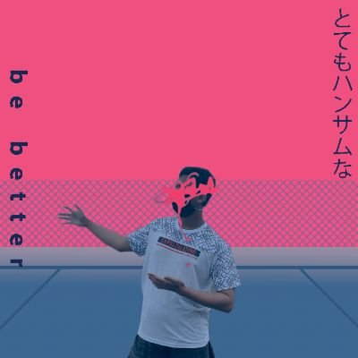

  

### My Profile's 😎
___

<h1 align="center">Halo, Saya <a href="https://github.com/MrHecka">MrHecka</a>!</h1>
<h1 align="center">Selamat Datang Di Profil Github Saya~ UwU</h1>

  

  <strong><a href="https://www.instagram.com/anone14_/">Instagram</a></strong> |
  <strong><a href="https://www.facebook.com/MrHecka/">Facebook</a></strong> |
  <strong><a href="https://twitter.com/heckabinary">Twitter</a></strong> |
  <strong><a href="https://www.twitch.tv/hecka014">Twitch</a></strong>

:page_with_curl: Yang sedang ku pelajari:
- Javascript
- Python

### About Me ⚠️
___

❤ Semoga Hari-Harimu Menyenangkan~ ❤

